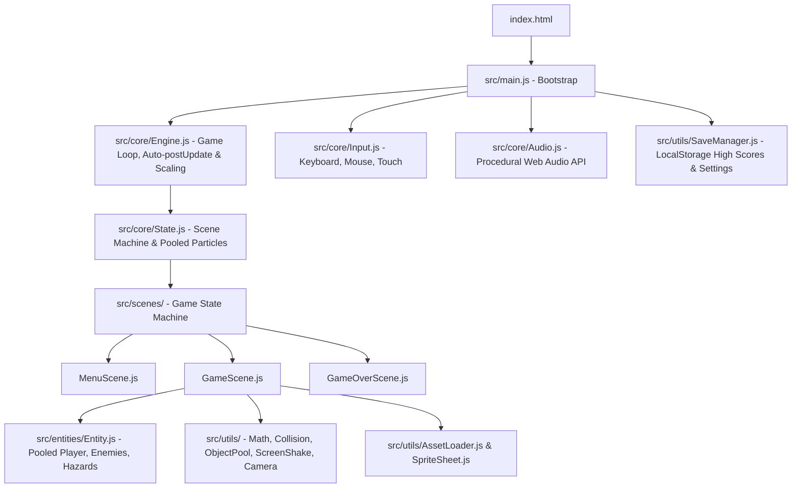

# Technical Architecture (ARCHITECTURE.md)

This document defines the technical structure, module responsibilities, data flow, and performance standards of the game engine. Every developer and AI agent must adhere to this architecture.

---

## 1. System Architecture & Modules

---

## 2. Directory Structure & Responsibilities

| File / Directory | Responsibility |
| :--- | :--- |
| `index.html` | Canvas element, HUD/UI overlays, and on-screen mobile touch controls |
| `style.css` | Responsive layout, letterbox scaling, color tokens, and modal animations |
| `src/main.js` | Bootstrap script, dependency wiring, input registration, and initial scene |
| `src/core/Engine.js` | Deterministic 60 FPS loop, clamped delta-time, automatic `input.postUpdate()`, tab visibility pause/resume |
| `src/core/Input.js` | Unified input abstraction (keyboard, mouse, virtual touch controls) |
| `src/core/Audio.js` | 100% code-based procedural Web Audio API synthesizer |
| `src/core/State.js` | Scene base class and object-pooled particle system |
| `src/scenes/MenuScene.js` | Start title screen, high score display, audio toggle, and play trigger |
| `src/scenes/GameScene.js` | Active gameplay loop, player movement, collisions, screen shake juice |
| `src/scenes/GameOverScene.js` | Post-game score tally, high-score recognition, restart and menu controls |
| `src/entities/Entity.js` | Base class for all game entities (player, enemies, hazards) with pool recycling |
| `src/utils/ObjectPool.js` | Generic object pool for zero-allocation GC optimization |
| `src/utils/SaveManager.js` | Safe, schema-versioned LocalStorage wrapper for scores and settings |
| `src/utils/ScreenShake.js` | Trauma-based dynamic camera shake generator |
| `src/utils/Camera.js` | 2D smooth tracking camera with bounds clamping and coordinate mapping |
| `src/utils/Timer.js` | Zero-allocation cooldowns, repeating delays, and progress normalization |
| `src/utils/AssetLoader.js` | Promise-based image and audio asset preloader |
| `src/utils/SpriteSheet.js` | Slices, indexes, and renders spritesheet frames and animations |
| `src/utils/math.js` | Vector math helpers (`lerp`, `clamp`, `distanceSq`, `angleBetween`, `normalize`) |
| `src/utils/Collision.js` | 2D collision tests (`circleVsCircle`, `rectVsRect`, `circleVsRect`, `pointInRect`) |
| `tests/` | Zero-dependency deterministic unit tests executed via `npm test` (`node --test`) |

---

## 3. Game Loop & Rendering Rules

1. **Delta-Time (`dt`)**:
   - All motion and timers are scaled by `dt` (in seconds).
   - `Math.min(dt, 0.1)` guards against tunneling and spiral-of-death lag spikes.
2. **Virtual Resolution (Canvas Scaling)**:
   - Fixed internal coordinate space (default: 960x540 widescreen).
   - Canvas scales responsively while preserving aspect ratio (letterbox/pillarbox).
   - Mouse and touch screen coordinates must always be converted to virtual canvas coordinates via `engine.screenToVirtual(x, y)`.
3. **Automated Input Reset**:
   - `engine.registerInput(input)` ensures `input.postUpdate()` executes automatically at the end of each frame, preventing single-frame input leaks.
4. **Object Pooling & Zero Allocations**:
   - Bullets, particles, and enemies are recycled in object pools to eliminate Garbage Collection stutter.
5. **Audio Autoplay**:
   - `AudioContext` is initialized or resumed on the first user interaction (`audio.init()`).
