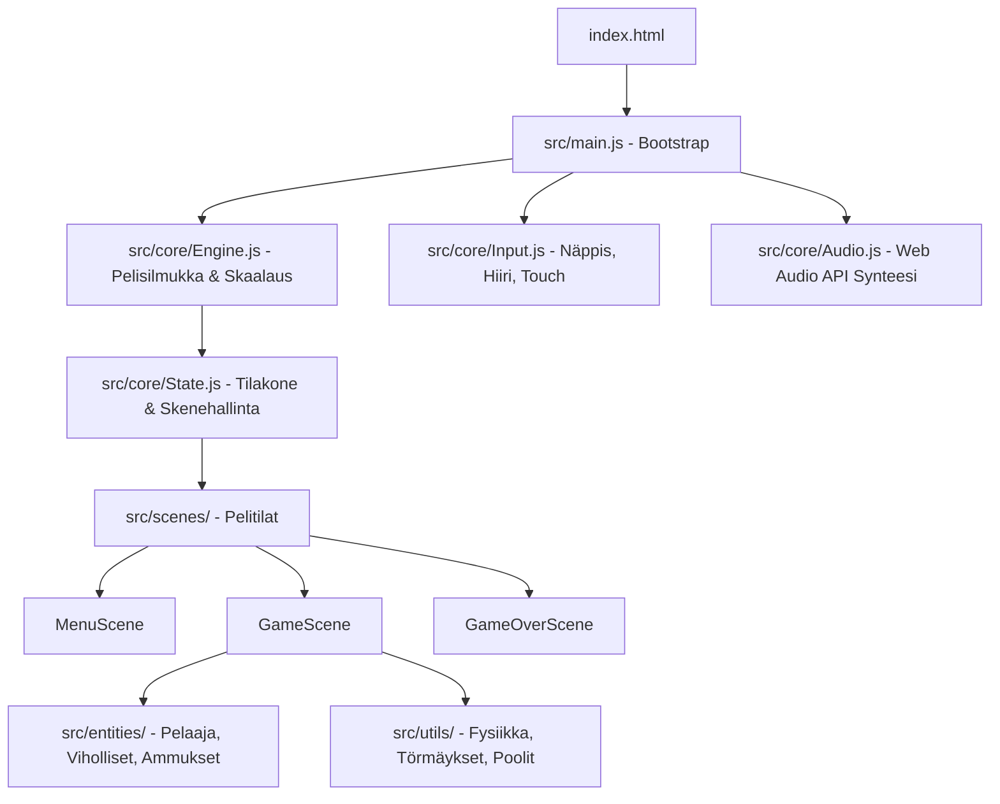

# Tekninen Arkkitehtuuri (Technical Architecture)

Tämä dokumentti määrittelee pelin teknisen rakenteen, komponenttijaon, datavirrat ja suorituskykyperiaatteet. Jokaisen kehittäjän ja agentin tulee noudattaa tätä rakennetta.

---

## 1. Järjestelmäarkkitehtuuri & Moduulit

---

## 2. Tiedostorakenne ja vastuut

| Tiedosto / Hakemisto | Vastuualue |
| :--- | :--- |
| `index.html` | Canvas-elementti, HUD/UI-overlayt ja mobiilikosketusnapit |
| `style.css` | Responsiivinen asettelu, kuvasuhteen lukitus, teema ja animaatiot |
| `src/main.js` | Sovelluksen käynnistys, riippuvuuksien alustus ja alkuskenen lataus |
| `src/core/Engine.js` | 60 FPS deterministinen pelisilmukka, suojattu delta-time, canvas-skaalaus |
| `src/core/Input.js` | Yhtenäinen syötekäsittelijä (keyboard, mouse, virtual touch d-pad) |
| `src/core/Audio.js` | Koodipohjainen Web Audio API -äänisyntetisaattori |
| `src/core/State.js` | Tilakone (Scene base class) ja partikkelisysteemi |
| `src/scenes/` | Itsenäiset pelitilat (`enter`, `exit`, `update`, `render`) |
| `src/entities/` | Peliobjektit, niiden tila, käyttäytyminen ja piirto |
| `src/utils/ObjectPool.js` | Geneerinen objektipooli roskienkeruun (GC) eliminointiin |
| `src/utils/math.js` | Pelimatematiikka (`lerp`, `clamp`, `distanceSq`, `angleBetween`) |
| `src/utils/Collision.js` | 2D-törmäystarkistukset (`circleVsCircle`, `rectVsRect`, `circleVsRect`) |

---

## 3. Pelisilmukan ja renderöinnin säännöt

1. **Delta-Time (`dt`)**:
   - Kaikki liike ja aikalaskenta kerrotaan `dt`:llä (sekunneissa).
   - `Math.min(dt, 0.1)` estää hyppäykset lagipiikeissä.
2. **Virtuaaliresoluutio (Canvas Scaling)**:
   - Pelin sisäinen virtuaaliresoluutio (oletus: 960x540 widescreen).
   - Canvas sovitetaan näyttöön säilyttäen kuvasuhde (letterbox/pillarbox).
   - Hiiren ja kosketuksen ruutukoordinaatit muunnetaan aina virtuaalikoordinaateiksi `engine.screenToVirtual(x, y)`.
3. **Objektipoolit (Object Pooling)**:
   - Ammukset, partikkelit ja viholliset kierrätetään pooleissa GC-nykimisen välttämiseksi.
4. **Äänten Autoplay**:
   - `AudioContext` herätetään ensimmäisestä käyttäjän painalluksesta (`audio.init()`).
