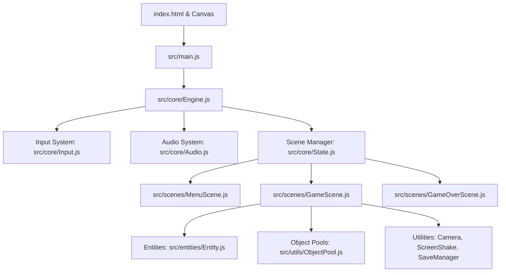

# System Architecture: {{GAME_TITLE}}

> **Project**: {{GAME_TITLE}}  
> **Engine**: Vanilla JavaScript (ES Modules) / HTML5 Canvas 2D  
> **Target Framerate**: Rock-Solid 60 FPS (Zero GC allocations in game loop)  

---

## 1. System Architecture & Component Diagram

---

## 2. Core Subsystems & Responsibilities

| Subsystem | File Path | Primary Responsibility |
| :--- | :--- | :--- |
| **Engine Loop** | `src/core/Engine.js` | 60 FPS `requestAnimationFrame` loop, clamped delta-time (`dt <= 0.1`), letterbox scaling. |
| **Input Handler** | `src/core/Input.js` | Unified keyboard, mouse, gamepad, and touch D-Pad listeners. Auto-cleans single-frame inputs. |
| **Audio Synthesizer** | `src/core/Audio.js` | 100% procedural Web Audio API sound generation. Zero audio file latency. |
| **Scene Manager** | `src/core/State.js` | Base scene lifecycle (`init`, `update`, `render`, `exit`) and particle emitter pool. |
| **Entity System** | `src/entities/Entity.js` | Pooled base entity class with position, velocity, radius, health, and reset methods. |
| **Memory Pools** | `src/utils/ObjectPool.js` | Pre-allocated instances of high-churn objects (particles, bullets, pickups) to eliminate GC stalls. |
| **Persistence** | `src/utils/SaveManager.js` | LocalStorage wrapper with schema versioning and incognito safety fallbacks. |

---

## 3. Zero-Allocation Memory Budget

To guarantee 60 FPS without Garbage Collection pauses:
1. **Zero Allocations in Loop**: No `new` objects, arrays, or closures inside `update(dt)` or `render(ctx)`.
2. **Pre-allocated Pools**:
   - Particle Pool: 100 instances.
   - Projectiles / Hazards: 30 instances.
3. **Reused Math Vectors**: Reuse temporary coordinate variables rather than returning fresh `{ x, y }` objects.
