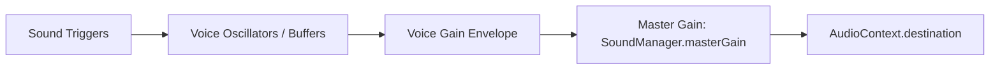

# Audio Design Specification: {{GAME_TITLE}}

> **Project**: {{GAME_TITLE}}  
> **Engine**: 100% Procedural Web Audio API (`src/core/Audio.js`)  
> **Standard**: Zero external mp3/wav files, zero latency, autoplay-policy compliant  

---

## 1. Audio Philosophy & Core Pillars

1. **Immediate Reaction & Zero Latency**: Code-synthesized audio guarantees instant sound triggering with no network fetch or decoding latency.
2. **Dynamic Scheduling**: All sound timing uses hardware-accurate `AudioContext.currentTime` scheduling.
3. **Ear Fatigue Prevention**: High-frequency sounds (lasers, hits) use lowpass filters and micro pitch variation (`freq * (1 + (Math.random() - 0.5) * 0.1)`).

---

## 2. Sound Effects Profile & Synthesizer Matrix

| SFX Name | Trigger Event | Oscillator Type | Frequency Profile | Envelope (Attack / Decay) |
| :--- | :--- | :--- | :--- | :--- |
| `playJump()` | Space / Touch A | `square` | `150Hz -> 600Hz` (exp ramp) | Attack: 0s, Decay: 0.15s |
| `playShoot()` | Space / Fire | `sawtooth` | `880Hz -> 110Hz` (exp ramp) | Attack: 0s, Decay: 0.12s |
| `playCoin()` | Collectible pickup | `sine` | Arpeggio: `987Hz (B5)` + `1318Hz (E6)` | Staggered 0.08s & 0.18s |
| `playHit()` | Damage taken | `triangle` | `220Hz -> 60Hz` (lin ramp) | Attack: 0s, Decay: 0.10s |
| `playExplosion()` | Target destroyed | White Noise + Lowpass | Filter: `800Hz -> 50Hz` | Attack: 0s, Decay: 0.35s |
| `playWin()` | Stage clear / Record | `triangle` | Fanfare: C5, E5, G5, C6 notes | Staggered 0.11s intervals |

---

## 3. Audio Bus & Master Volume Control

- **Default Master Volume**: `0.3` (30% volume to prevent clipping and protect user hearing).
- **Mute Persistence**: Mute toggle state persisted across sessions via `SaveManager.js`.
- **Autoplay Handling**: `audio.init()` called strictly on genuine user gesture (`click`, `keydown`).
