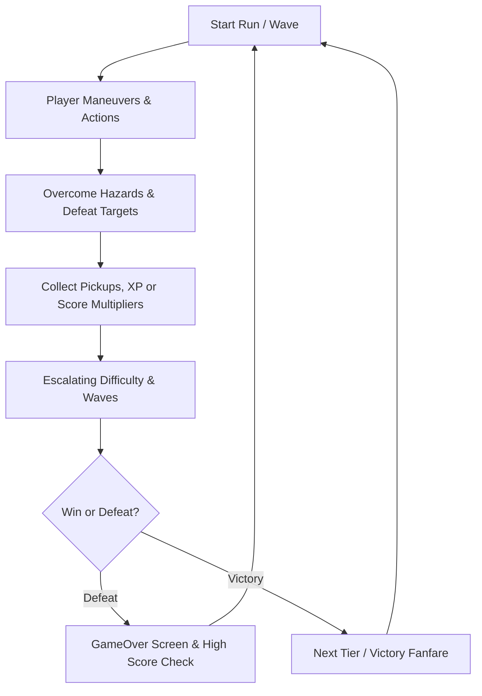

# Game Design Document (GDD): {{GAME_TITLE}}

> **Project**: {{GAME_TITLE}}  
> **Author / Lead**: Solo Developer (Assisted by AI Pair-Programmer)  
> **Version**: {{VERSION}}  
> **Target Release**: Web (PWA / itch.io) & Desktop (.exe)  

---

## 1. Executive Summary & Pitch

- **High Concept / Elevator Pitch**: {{ELEVATOR_PITCH}}
- **Genre**: {{GENRE}} (e.g., Fast-Paced Roguelite Arcade / Precision 2D Platformer / Top-Down Arena Shooter)
- **Target Audience**: {{AUDIENCE}}
- **Unique Selling Points (USPs)**:
  1. {{USP_1}}
  2. {{USP_2}}
  3. {{USP_3}}
- **Reference Games / Inspirations**: {{INSPIRATIONS}}

---

## 2. Core Gameplay Loop

1. **Second-to-Second Loop**: Movement, dodging hazards, precise input reactions.
2. **Minute-to-Minute Loop**: Clearing waves, balancing risk vs. reward for collectibles.
3. **Session Loop**: Surviving high-difficulty escalations, logging new personal bests in `SaveManager`.

---

## 3. Player Mechanics & Movement

- **Virtual Resolution**: 960x540 virtual internal resolution (16:9 widescreen).
- **Movement Model**:
  - Base Velocity: `{{PLAYER_SPEED}} px/sec`
  - Handling: Responsive arcade controls with normalized vector movement.
  - Bounds: Clamped within internal screen borders (`0` to `960`, `0` to `540`).
- **Actions & Abilities**:
  - Primary Action (Space / Touch Button A): {{PRIMARY_ACTION}}
  - Secondary Action (Shift / Touch Button B): {{SECONDARY_ACTION}}
  - Passive Attributes: Health: `{{PLAYER_HEALTH}}`, Collision Radius: `{{PLAYER_RADIUS}}px`.

---

## 4. Input & Control Mapping

| Input Action | Keyboard | Mouse | Mobile Touch | Gamepad |
| :--- | :--- | :--- | :--- | :--- |
| **Move Up / Down** | W / S or Up / Down | Cursor Tracking | Virtual D-Pad Y | Left Stick Y / D-Pad |
| **Move Left / Right** | A / D or Left / Right | Cursor Tracking | Virtual D-Pad X | Left Stick X / D-Pad |
| **Primary Action** | Spacebar | Left Click | Button A (`#touch-btn-a`) | Face Button A / Trigger |
| **Secondary Action** | Shift / KeyZ | Right Click | Button B (`#touch-btn-b`) | Face Button B / Shoulder |
| **Pause / Resume** | Escape / KeyP | Pause Button | Pause Icon | Start / Menu Button |

---

## 5. Game Rules & Scoring Economy

- **Scoring Breakdown**:
  - Standard Target / Collectible: `+{{POINTS_TARGET}} pts`
  - Hazard Clearance: `+{{POINTS_HAZARD}} pts`
  - Flawless Wave Clear: `+{{POINTS_WAVE}} pts`
- **Win Condition**: {{WIN_CONDITION}}
- **Loss Condition**: Player health reaches 0 or timer runs out.

---

## 6. Juice, Polish & Game Feel

1. **Trauma Screen Shake**: Screen shakes non-linearly (`trauma^2`) on hits and explosions (`ScreenShake.js`).
2. **Hit Flashes**: Player and enemies flash white for `0.08s` upon receiving damage.
3. **Particle Bursts**: Burst of 12–24 pooled particles on destructions and collection events (`ObjectPool.js`).
4. **Procedural Web Audio**: Zero-latency procedural sound triggers for all actions (`src/core/Audio.js`).
