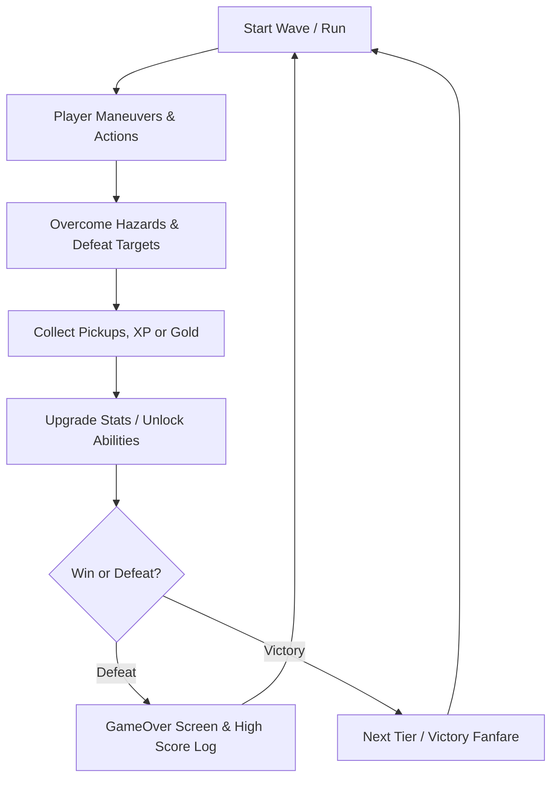

# Game Design Document (GDD): {{GAME_TITLE}}

> **Project**: {{GAME_TITLE}}  
> **Author / Lead**: Solo Developer (Assisted by AI Pair-Programmer)  
> **Version**: 1.0.0  
> **Target Release**: Web (PWA / itch.io) & Desktop (.exe)  

---

## 1. Executive Summary & Pitch

- **High Concept / Elevator Pitch**: {{ELEVATOR_PITCH}}
- **Genre**: {{GENRE}} (e.g., Fast-Paced Roguelite Arcade / Precision 2D Platformer / Top-Down Arena Shooter)
- **Target Audience**: {{AUDIENCE}}
- **Unique Selling Points (USPs)**:
  1. {{USP_1}}
  2. {{USP_2}}
  3. {{USP_3}}
- **Reference Games / Inspirations**: {{INSPIRATIONS}} (e.g., Vampire Survivors, Celeste, Asteroids)

---

## 2. Core Gameplay Loop



1. **Second-to-Second Loop**: Movement, dodging hazards, precise input reactions.
2. **Minute-to-Minute Loop**: Clearing waves, balancing risk vs. reward for collectibles.
3. **Session Loop**: Surviving high-difficulty escalations, logging new personal bests in `SaveManager`.

---

## 3. Player Mechanics & Movement

- **Coordinate Resolution**: 960x540 virtual internal resolution (16:9 widescreen).
- **Movement Model**:
  - Max Velocity: `{{SPEED}} px/sec`
  - Acceleration / Deceleration: Smooth lerping or immediate arcade response.
  - Bounds Behavior: Clamped within screen borders or wrapped horizontally.
- **Actions & Abilities**:
  - Primary Action (Space / Touch Button A): {{PRIMARY_ACTION}}
  - Secondary Action (Shift / KeyZ / Touch Button B): {{SECONDARY_ACTION}}
  - Passive Attributes: Health / Shield, Collision Radius.

---

## 4. Input & Control Mapping

| Input | Keyboard | Mouse | Mobile Touch | Gamepad |
| :--- | :--- | :--- | :--- | :--- |
| Move Left | `ArrowLeft` / `KeyA` | — | D-Pad Left | Left Stick / D-Pad |
| Move Right | `ArrowRight` / `KeyD` | — | D-Pad Right | Left Stick / D-Pad |
| Move Up | `ArrowUp` / `KeyW` | — | D-Pad Up | Left Stick / D-Pad |
| Move Down | `ArrowDown` / `KeyS` | — | D-Pad Down | Left Stick / D-Pad |
| Primary Action | `Space` | Left Click | Action A (Round) | Button South (A/X) |
| Secondary Action | `KeyZ` / `ShiftLeft` | Right Click | Action B (Round) | Button West (X/Square) |
| Pause / Menu | `Escape` / `KeyP` | UI Icon | Pause Icon | Start / Options |

---

## 5. Entities, Enemies & Hazards

### 5.1 Player Entity (`src/entities/Player.js`)
- **Hitbox**: Bounding circle (radius: `16px`).
- **Health System**: Max HP `100`, invulnerability frames (i-frames) on hit `0.8s`.
- **Feedback**: Flashing alpha, trauma-based screen shake on hit.

### 5.2 Enemy Archetypes
1. **Chaser**: Directly vectors towards player coordinates with slight steering delay.
2. **Shooter / Spitter**: Maintains a fixed orbit radius and fires pooled projectiles.
3. **Hazard / Obstacle**: Static or bouncing obstacles with reflective collision.

---

## 6. Progression & Difficulty Scaling

- **Wave Formula**: `SpawnCount = BaseCount + Math.floor(WaveNumber * 1.5)`
- **Speed Escalation**: `EnemySpeed = BaseSpeed * (1 + WaveNumber * 0.08)`
- **Score System**:
  - Standard Target: `+10 pts`
  - Hazard Clear: `+25 pts`
  - Consecutive Combo Multiplier: `x1.0` up to `x4.0` without taking damage.

---

## 7. User Interface (UI) & HUD Wireframe

```text
+-------------------------------------------------------------+
| [SCORE: 002450]          [HIGH: 012000]          [HP: ■■■■□] |
|                                                             |
|                         (PLAY AREA)                         |
|                                                             |
|                                                             |
| [▲]                                                   [ B ] |
|[◀ ][ ▶]                                              [ A ]  |
| [▼] (Touch D-Pad)                       (Touch Action Btns) |
+-------------------------------------------------------------+
```

- **Scene Flow**:
  - `MenuScene`: Title, High Score, Play Button, Audio Mute toggle.
  - `GameScene`: Live game loop, HUD overlay, screen shake, particles.
  - `GameOverScene`: Run statistics, new high score notification, retry shortcut (`Space`).

---

## 8. Performance & Audio Standards

- **Target Framerate**: 60 FPS deterministic.
- **Audio Output**: 100% procedural Web Audio API (zero audio file assets required).
- **Garbage Collection**: 0 allocations in active loop; all particles and entities use `ObjectPool.js`.
- **State Storage**: High scores and user settings automatically saved via `SaveManager.js`.
