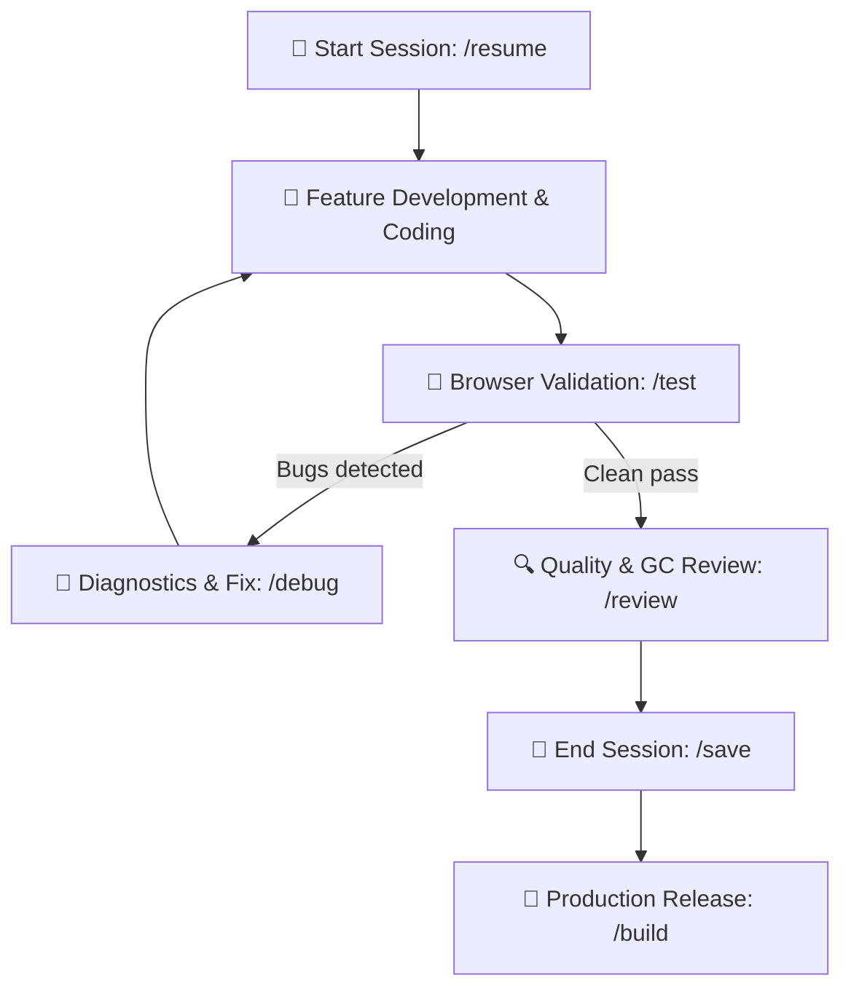

# AGENTS.md – Game Development Agent Guidelines (Solo Dev Kit)

This repository is a professional **HTML5 Canvas / Vanilla JavaScript** game development template and cognitive environment optimized for **seamless collaboration between a solo developer and an AI coding agent**.

---

## 🎯 Core Operating Principles for the Agent

1. **Single Source of Truth**:
   - All persistent project data, architecture, game design, styling tokens, and status reside in `.agents/blueprint/`.
   - Never make assumptions about game mechanics without checking `.agents/blueprint/GDD.md`.
   - All UI components, buttons, and colors must strictly adhere to `.agents/blueprint/STYLE_GUIDE.md`.
2. **Engineering Standards**:
   - Always follow `.agents/rules/game-dev.md`.
   - Deterministic 60 FPS game loop with protected `dt` (`Math.min(dt, 0.1)`).
   - Zero Garbage Collection thrashing in the loop: always use `ObjectPool.js` for particles, projectiles, and frequently instantiated objects.
   - Clean modern Vanilla JavaScript (ES Modules), zero bloated external dependencies.
3. **Context and Token Management**:
   - Keep sessions focused and compact.
   - When the developer ends the session, execute `/save` (`game-memory`).
   - When starting a fresh session, execute `/resume` (`game-memory`) and read only the 2–4 key files specified in `SESSION_STATE.md`.

---

## ⚡ Slash Commands & Skills Mapping

The agent must activate the corresponding skill (`.agents/skills/<skill-name>/SKILL.md`) when the user invokes these commands or requests the corresponding task:

| Command | Skill | Purpose |
| :--- | :--- | :--- |
| `/init` | `game-init` | Initialize new game: *Grill-Me* interview, GDD & blueprint creation, playable scaffold |
| `/onboard`, `/audit` | `game-onboard` | Audit and reverse-engineer existing codebase, build blueprint |
| `/review`, `/optimize` | `game-review` | Code quality assurance: GC analysis, 60 FPS, decoupled architecture, style audit |
| `/test`, `/playtest` | `game-test` | Automated browser playtesting: console errors, canvas draw, 60 FPS, screenshot report |
| `/debug`, `/fix` | `game-debug` | Systematic diagnostics: root cause analysis, fix proposal, `KNOWN_BUGS.md` logging |
| `/save`, `/checkpoint` | `game-memory` | Session end: summarize state, define next task, save handoff context |
| `/resume`, `/start-session` | `game-memory` | Session start: read state and deliver a concise 3-sentence kick-off debrief |
| `/build`, `/deploy` | `game-deploy` | PWA manifest, service worker, itch.io & GitHub Pages release packaging |

---

## 🔄 The Solo Developer Loop

