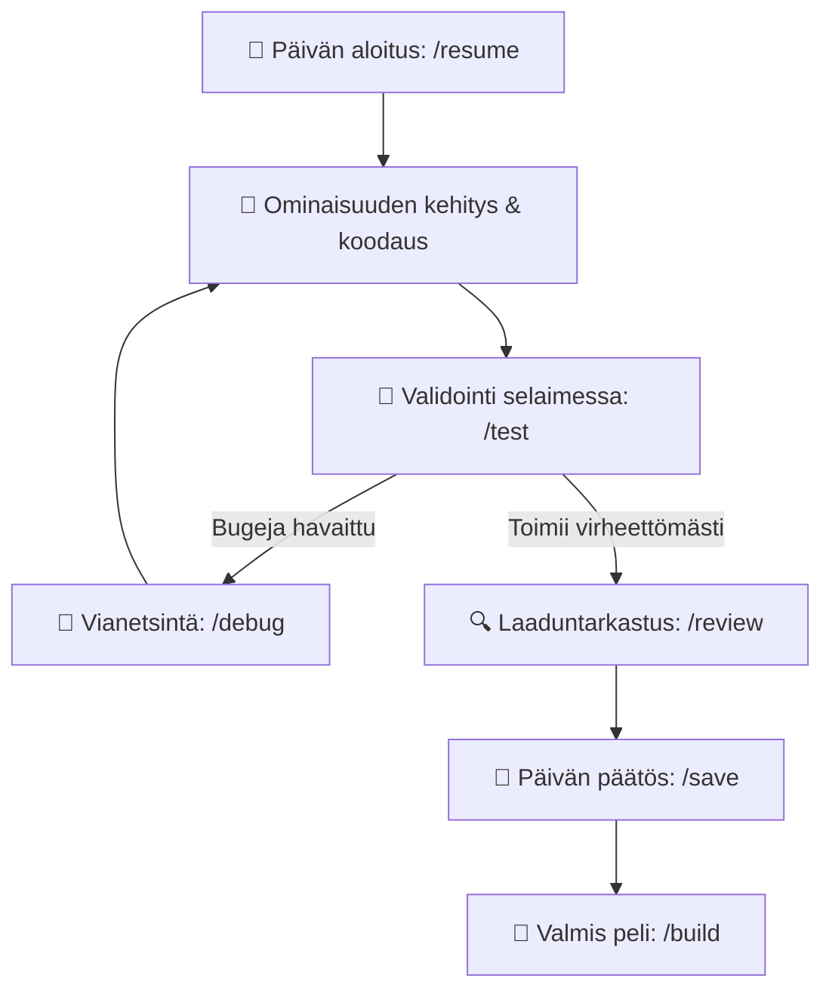

# AGENTS.md – Pelinkehityksen Agenttiohjeistus (Gameworkflow02)

Tämä repository on **HTML5 Canvas / Vanilla JS** -pelinkehityksen ammattimainen työpohja (Game Dev Kit), joka on optimoitu **yhden hengen kehittäjän ja AI-agentin saumattomaan yhteistyöhön**.

---

## 🎯 Toimintaperiaatteet Agentille

1. **Yksi totuuden lähde (Single Source of Truth)**:
   - Kaikki pysyvä tieto pelistä, arkkitehtuurista, tilasta ja tyyleistä asuu kansiossa `.agents/blueprint/`.
   - Älä koskaan tee oletuksia pelin mekaniikoista tarkistamatta tiedostoa `.agents/blueprint/GDD.md`.
   - Kaikkien UI-elementtien ja värien on noudatettava tiedostoa `.agents/blueprint/STYLE_GUIDE.md`.
2. **Koodaustandardit**:
   - Noudata aina sääntötiedostoa `.agents/rules/game-dev.md`.
   - Deterministinen 60 FPS pelisilmukka suojatulla `dt`:llä (`Math.min(dt, 0.1)`).
   - Nolla GC-kuormaa silmukassa: käytä aina `ObjectPool.js` -luokkaa partikkeleille, ammuksille ja usein luotaville olioille.
   - Puhdas Vanilla JavaScript (ES Modules), ei turhia ulkoisia riippuvuuksia.
3. **Kontekstin ja muistin hallinta**:
   - Istunnot ovat lyhyitä ja fokusoituja.
   - Kun käyttäjä haluaa lopettaa, aja `/save` (`game-memory`).
   - Kun aloitat uuden istunnon, aja `/resume` (`game-memory`) ja lue vain ne 2–4 avaintiedostoa, jotka on listattu `SESSION_STATE.md`:ssä.

---

## ⚡ Slash-Komennot & Skillit (Komentokartta)

Agentin tulee aktivoida vastaava taito (`.agents/skills/<skill-name>/SKILL.md`), kun käyttäjä käyttää näitä komentoja tai pyytää vastaavaa toimenpidettä:

| Komento | Taito (Skill) | Tarkoitus |
| :--- | :--- | :--- |
| `/init` | `game-init` | Uuden pelin alustus: Grill-Me -haastattelu, GDD & blueprintin luonti, pelirungon pystytys |
| `/onboard`, `/audit` | `game-onboard` | Olemassa olevan/keskeneräisen koodikannan analysointi ja blueprintin generointi |
| `/review`, `/optimize` | `game-review` | Koodin laadunvarmistus: GC-analyysi, 60 FPS, spagetin purku ja tyyliauditointi |
| `/test`, `/playtest` | `game-test` | Automaattinen selaintestaus: konsolivirheet, canvas-piirto, FPS, audio ja kuvakaappaus |
| `/debug`, `/fix` | `game-debug` | Vikadiagnostiikka: ongelman paikannus, korjausehdotus ja bugilokin kirjaus |
| `/save`, `/checkpoint` | `game-memory` | Päivän/session päätös: tilanteen, seuraavan tehtävän ja avaintiedostojen tallennus |
| `/resume`, `/start-session` | `game-memory` | Uuden puhtaan session aloitus: lukee muistin ja antaa heti 3 lauseen tilannekuvan |
| `/build`, `/deploy` | `game-deploy` | PWA manifest, service worker, itch.io & GitHub Pages jakelupaketointi |

---

## 🔄 Kehittäjän Päiväjärjestys (Workflow Loop)

