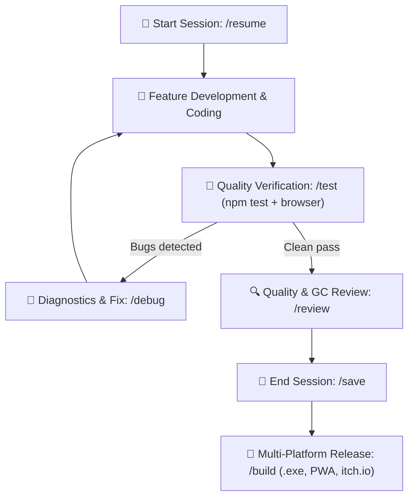

# AGENTS.md – Game Development Agent Guidelines (Solo Dev Kit)

This repository is a professional **HTML5 Canvas / Vanilla JavaScript** game development template and cognitive environment optimized for **seamless collaboration between a solo developer and an AI coding agent**. It is designed to deliver studio-quality, repeatable, production-grade results without external game engines.

---

## 🎯 Core Operating Principles for the Agent

1. **Single Source of Truth & Studio Documentation**:
   - All persistent project data, architecture, game design, styling tokens, and status reside in `.agents/blueprint/` and `docs/`.
   - Never make assumptions about game mechanics without checking `.agents/blueprint/GDD.md`.
   - Maintain the comprehensive studio documentation suite: GDD, Art Bible, Audio Spec, Level Design & Economy, QA Plan, and Marketing One-Pager.
   - All UI components, buttons, and colors must strictly adhere to `.agents/blueprint/STYLE_GUIDE.md`.
2. **Engineering Standards**:
   - Always follow `.agents/rules/game-dev.md`.
   - Deterministic 60 FPS game loop with protected `dt` (`Math.min(dt, 0.1)`).
   - Automated input cleanup: `engine.registerInput(input)` handles single-frame resets.
   - Zero Garbage Collection thrashing in the loop: always use `ObjectPool.js` for particles, projectiles, and frequently instantiated objects.
   - Clean modern Vanilla JavaScript (ES Modules), zero bloated external dependencies.
   - Quality gate: always run `npm test` before declaring code features verified.
3. **Context and Token Management**:
   - Keep sessions focused and compact.
   - When the developer ends the session, execute `/save` (`game-memory`).
   - When starting a fresh session, execute `/resume` (`game-memory`) and read only the 2–4 key files specified in `SESSION_STATE.md`.

---

## ⚡ Slash Commands & Skills Mapping

The agent must activate the corresponding skill (`.agents/skills/<skill-name>/SKILL.md`) when the user invokes these commands or requests the corresponding task:

| Command | Skill | Purpose |
| :--- | :--- | :--- |
| `/init` | `game-init` | Initialize new game: 8-question *Grill-Me* interview, complete studio docs suite, and playable 60 FPS scaffold |
| `/onboard`, `/audit` | `game-onboard` | Audit and reverse-engineer existing codebase, build blueprint |
| `/review`, `/style-check` | `game-review` | Code quality & UI style audit: linter (`npm run lint:style`), GC analysis, style drift prevention |
| `/test`, `/playtest` | `game-test` | Automated testing: runs deterministic `npm test` + browser playtest (console errors, canvas, 60 FPS) |
| `/debug`, `/fix` | `game-debug` | Systematic diagnostics: root cause analysis, fix proposal, `KNOWN_BUGS.md` logging |
| `/save`, `/checkpoint` | `game-memory` | Session end: summarize state, define next task, save handoff context |
| `/resume`, `/start-session` | `game-memory` | Session start: read state and deliver a concise 3-sentence kick-off debrief |
| `/build`, `/deploy` | `game-deploy` | Packaging for Web PWA, itch.io ZIP, GitHub Pages, and standalone Desktop `.exe` |

---

## 🔄 The Solo Developer Loop

