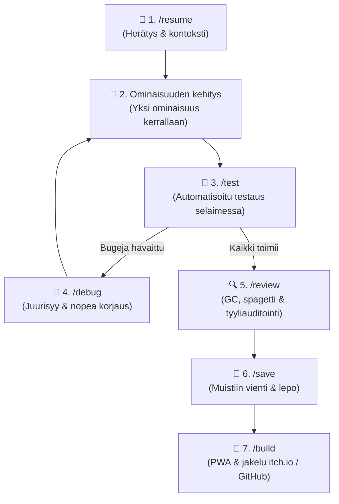

# HTML/CSS/JS Pelinkehitystemplate (Antigravity Solo Dev Kit)

Tämä repository on ammattimainen kehitystemplate ja työnkulkupaketti suorituskykyisten **HTML5 Canvas / JavaScript** -pelien rakentamiseen, olemassa olevien projektien haltuunottoon, koodin optimointiin, automatisoituun selaintestaukseen sekä **pitkäkestoiseen muistiin ja sessiovaihtoihin** yhden hengen tiimille AI-agentin kanssa.

---

## ⚡ Slash-Komennot & Toiminnot (Commands & Skills)

Kaikki toiminnot ohjataan suoraan ytimekkäillä slash-komennoilla ilman pitkiä selityksiä:

### 1. 🌅 Uuden Päivän / Session Aloitus (`/resume`)
Kun aloitat uuden puhtaan keskustelun:
```
/resume
```
- Lukee välittömästi sessiomuistin ja päivän 2–4 avaintiedostoa.
- Antaa heti napakan tilannekuvan ja suositellun aloituspisteen ilman kontekstin tuhlausta!

### 2. 🚀 Uuden Pelin Aloitus (`/init`)
Aloita tyhjästä tai ideasta:
```
/init
```
- **Grill-Me -haastattelu**: Kysyy 4 ydinkysymystä, jos valmista suunnitelmaa ei ole.
- **Blueprintin generointi**: Luodaan `GDD.md`, `ARCHITECTURE.md` ja `PROJECT_STATUS.md` kansioon `.agents/blueprint/`.
- **Valmis koodirunko**: Pystyttää heti pelattavan 60 FPS Canvas-rungon, multi-inputin, Web Audio -äänet ja `src/utils/` -kirjaston.

### 3. 🧪 Automatisoitu Pelitestaus Selaimessa (`/test` tai `/playtest`)
Testaa peli koodimuutosten jälkeen ilman manuaalista säätöä:
```
/test
```
- Avaa pelin selaimessa (`browser_subagent`).
- Tarkistaa konsolivirheet, Canvas-renderöinnin, 60 FPS -vakauden ja Web Audio -tilan.
- Tuottaa visuaalisen testiraportin kuvakaappauksineen.

### 4. 🐛 Vikadiagnostiikka & Korjaus (`/debug` tai `/fix`)
Kun jokin ei toimi, näyttö on musta tai fysiikka sekoaa:
```
/debug
```
- Etsii juurisyyn: koordinaattivirheet, NaN-arvot, z-indexit tai tilakoneen jäätymiset.
- Korjaa koodin ja kirjaa havainnot tiedostoon `.agents/blueprint/KNOWN_BUGS.md`.

### 5. 🔍 Koodin Laadunvarmistus & Optimointi (`/review` tai `/optimize`)
Tarkista peli koodauspäivän päätteeksi:
```
/review
```
- **Suorituskykytarkastus (60 FPS)**: GC-kuorma (objektipoolit), törmäystarkistukset, layout thrashing.
- **Spagetin purku**: Jättiluokat, liian tiukka kytkentä ja globaalit muuttujat.
- **Tyyliauditointi (Style Drift)**: Varmistaa, että CSS-muuttujat ja `.btn-*` -standardit pitävät.

### 6. 🌆 Päivän / Session Päätös (`/save`)
Kun haluat lopettaa keskustelun ja säästää tokeneita:
```
/save
```
- Tiivistää tehdyt muutokset ja koodin vakauden tiedostoon `.agents/blueprint/SESSION_STATE.md`.
- Kirjaa kehityspäiväkirjaan merkinnän tiedostoon `.agents/blueprint/DEV_LOG.md`.
- Määrittää tarkan seuraavan tehtävän huomiselle. Voit sulkea chatin turvallisin mielin.

### 7. 📦 Paketointi & Julkaisu (`/build` tai `/deploy`)
Kun peli on valmis julkaistavaksi:
```
/build
```
- PWA manifest + Service Worker offline-pelaamista varten.
- itch.io ja GitHub Pages -jakelupaketointi.

---

## 🔄 Kehittäjän Työnkulkukartta (Solo Dev Loop)



---

## 📁 Projektin Rakenne (Skill-First)

Projektin pysyvä totuuden lähde (Single Source of Truth) sijaitsee kansiossa `.agents/blueprint/`:

```text
.agents/
├── blueprint/                  # 📌 Koko projektin pysyvä totuuden lähde ja muisti
│   ├── GDD.md                  # Pelisuunnitelma (konsepti, mekaniikat, ohjaus)
│   ├── ARCHITECTURE.md         # Tekninen arkkitehtuuri (luokat, silmukka, datavirta)
│   ├── STYLE_GUIDE.md          # 🎨 Design System: CSS-muuttujat, napit (.btn-*), typografia
│   ├── PROJECT_STATUS.md       # Nykytila, valmiusaste %, tekninen velka ja tiekartta
│   ├── CODE_REVIEW.md          # Laatu- ja optimointiraportti terveyspisteineen
│   ├── KNOWN_BUGS.md           # Tiedossa olevat ja korjatut bugit
│   ├── SESSION_STATE.md        # 🧠 Aktiivinen viestikapula sessioiden välillä
│   └── DEV_LOG.md              # 📜 Kehityspäiväkirja ja tehtyjen sessioiden historia
├── rules/
│   └── game-dev.md             # Pelinkehityksen parhaat käytännöt (60fps, delta-time, pooling, canvas)
└── skills/
    ├── game-init/              # /init – Uuden pelin alustus ja boilerplate-resurssit
    ├── game-onboard/           # /onboard – Keskeneräisen koodin auditointi
    ├── game-review/            # /review – Koodin laadunvarmistus & optimointi
    ├── game-test/              # /test – Automatisoitu selaintestaus ja raportointi
    ├── game-debug/             # /debug – Vikadiagnostiikka ja korjaus
    ├── game-memory/            # /save & /resume – Pitkäkestoinen sessiomuisti
    └── game-deploy/            # /build – PWA ja jakelupaketointi (itch.io, GitHub Pages)
```

---

## 🎮 Arkkitehtuurin Ydinominaisuudet

- **Engine (`src/core/Engine.js`)**: 60 FPS `requestAnimationFrame`, suojattu `deltaTime`, automaattinen pause/resume välilehden vaihtuessa (`visibilitychange`) ja resoluution skaalaus.
- **Input (`src/core/Input.js`)**: Yhtenäinen näppäimistö-, hiiri- ja kosketusnäyttöohjaus virtuaalisilla napeilla.
- **Audio (`src/core/Audio.js`)**: 100% koodipohjainen Web Audio API -äänisynteesi tarkalla kellotuksella ilman ulkoisia tiedostoja.
- **State & Juice (`src/core/State.js`)**: Skenehallinta ja partikkelisysteemi, joka käyttää `ObjectPool`ia muistin säästämiseksi.
- **Utilities (`src/utils/`)**:
  - `ObjectPool.js`: Geneerinen objektipooli (GC-lagipiikkien eliminointi).
  - `math.js`: `clamp`, `lerp`, `distanceSq`, `angleBetween`, `normalize`.
  - `Collision.js`: `circleVsCircle`, `rectVsRect`, `circleVsRect`, `pointInRect`.
