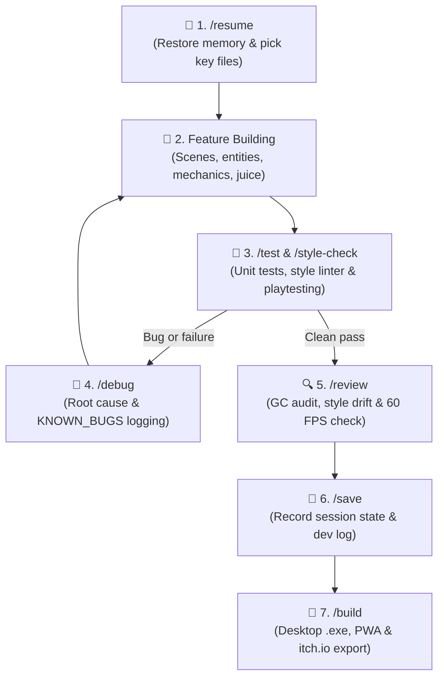

# 🎮 Agentic Games Template (Solo Dev Kit)

[](LICENSE)
[](#-core-engine--studio-features)
[](#-slash-commands--skills)
[](#-studio-quality-standards)
[](tests/)

A professional, high-performance **HTML5 Canvas / Vanilla JavaScript** game development template and cognitive workflow kit optimized for **solo developers pair-programming with AI coding agents** (Antigravity IDE, Claude, Cursor, Copilot). Designed to deliver **studio-quality, reproducible results** with zero third-party game engine bloat.

---

## 💡 Why This Template?

Building games with AI coding assistants can quickly lead to context explosion, spaghetti code, memory leaks (Garbage Collection frame spikes), inconsistent UI drift, and broken state machines.

This repository solves these challenges with:
- **Zero Heavy Dependencies**: Pure ES Modules, zero external game engines (no Phaser/Pixi bloat), and 100% transparent code ownership.
- **Skill-First Cognitive System**: Automated AI behaviors via discrete slash commands (`/init`, `/test`, `/style-check`, `/debug`, `/review`, `/save`, `/build`).
- **Single Source of Truth**: All architecture, game design, styling tokens, bug registries, and developer logs live in `.agents/blueprint/` and `docs/`.
- **Studio Documentation Suite**: Out-of-the-box standard templates for GDD, Art Bible, Audio Spec, Level Design & Economy, QA Test Plan, and Marketing One-Pagers.
- **Long-Term Memory**: Seamlessly switch chats and save tokens without losing project context or architectural state.
- **Battle-Tested 60 FPS Standards**: Built-in object pooling, clamped delta-time, trauma-based screen shake, 2D smooth tracking camera, and procedural Web Audio synthesis.
- **Automated Quality Gates**: Instant deterministic unit testing (`npm test` via native `node:test`), automated UI style linter, and GitHub Actions CI.
- **Multi-Platform Releases**: One-command packaging for standalone **Windows Desktop executable (.exe)**, offline Web PWA, itch.io ZIP, and GitHub Pages.

---

## 🔄 The Solo Developer Loop

When developing with an AI assistant, maintain a disciplined, high-velocity loop:



---

## ⚡ Slash Commands & Skills

Control your AI assistant with crisp, standardized commands:

### 🔄 Lifecycle & Quality Commands
| Command | Skill | Description |
| :--- | :--- | :--- |
| `/resume` | `game-memory` | **Start of Day**: Restores memory from `SESSION_STATE.md` and loads only 2–4 key files to minimize token usage. |
| `/init` | `game-init` | **New Game**: Triggers an 8-question *Grill-Me* design interview, writes the complete studio docs suite, and scaffolds a working 60 FPS game. |
| `/onboard` | `game-onboard` | **Legacy Audit**: Dissects existing codebases, audits timing/rendering, and generates a blueprint structure. |
| `/test` | `game-test` | **Automated Testing**: Runs deterministic unit tests (`npm test`) and browser playtesting checking console errors, canvas drawing, and 60 FPS. |
| `/style-check` | `game-review` | **Style Validation**: Runs the automated style linter (`npm run lint:style`), enforcing button classes (`.btn-*`), `:root` tokens, and zero UI drift. |
| `/debug` | `game-debug` | **Diagnostics**: Locates root causes (canvas coordinate bugs, NaN delta-time, z-index traps) and updates `KNOWN_BUGS.md`. |
| `/review` | `game-review` | **Quality Assurance**: Inspects for GC allocations in the loop, God objects, and CSS Style Drift. |
| `/save` | `game-memory` | **End of Day**: Compiles session achievements, logs next steps in `SESSION_STATE.md` and commits to `DEV_LOG.md`. |
| `/build` | `game-deploy` | **Distribution**: Generates standalone Windows Desktop `.exe` binaries, offline PWA manifests, and itch.io zips. |

---

## 📁 Repository Structure

```text
.
├── .agents/
│   ├── blueprint/              # 📌 Persistent Single Source of Truth
│   │   ├── GDD.md              # Game Design Document (rules, mechanics, inputs)
│   │   ├── ARCHITECTURE.md     # System architecture, class responsibilities, loop data flow
│   │   ├── STYLE_GUIDE.md      # 🎨 Design System: CSS tokens, button standards (.btn-*), HUD
│   │   ├── PROJECT_STATUS.md   # Current status, feature matrix, roadmap & technical debt
│   │   ├── CODE_REVIEW.md      # Performance and code health scorecards (A–F)
│   │   ├── KNOWN_BUGS.md       # Root-cause bug registry and fixed issues
│   │   ├── SESSION_STATE.md    # 🧠 Handoff baton between AI conversations
│   │   └── DEV_LOG.md          # 📜 Chronological developer diary
│   ├── rules/
│   │   └── game-dev.md         # Non-negotiable game dev rules (60 FPS, delta-time, pooling)
│   └── skills/                 # ⚡ Autonomous agent tools & execution prompts
│       ├── game-init/          # Scaffolding and studio documentation generator
│       │   └── resources/docs/ # 📚 Studio docs templates (Art Bible, Audio, Level Design, QA, Marketing)
│       ├── game-onboard/       # Codebase discovery and architecture mapping
│       ├── game-review/        # GC, coupling, and automated style audits
│       ├── game-test/          # Deterministic unit testing and automated browser verification
│       ├── game-debug/         # Diagnostic workflows
│       ├── game-memory/        # Token-efficient save/resume protocol
│       └── game-deploy/        # Multi-target distribution (.exe, PWA, itch.io)
├── .github/workflows/
│   └── ci.yml                  # 🚀 Automated GitHub Actions CI test pipeline
├── scripts/
│   └── check-style.js          # 🎨 Zero-dependency automated UI style linter
├── tests/                      # 🧪 Deterministic unit tests (node --test)
│   ├── math.test.js            # Vector math, clamping, and interpolation tests
│   ├── collision.test.js       # Circle and AABB box collision intersection tests
│   ├── pool.test.js            # Object pool recycling & zero memory leak tests
│   └── save.test.js            # SaveManager fallback & local storage tests
├── AGENTS.md                   # 🎯 Primary AI Agent instruction card
├── package.json                # 📦 Scripts: test, lint:style, dev, build:exe
├── LICENSE                     # 📄 MIT License
├── README.md                   # 📖 Project documentation
└── .gitignore                  # 🛡️ Clean repository guard
```

---

## 🎮 Core Engine & Studio Features

When initialized (`/init`), the generated scaffold includes:

1. **Deterministic Engine (`src/core/Engine.js`)**:
   - 60 FPS `requestAnimationFrame` loop with clamped delta-time (`Math.min(dt, 0.1)`).
   - Automated input state reset at frame end via `engine.registerInput(input)`.
   - Built-in `visibilitychange` listener with auto-pause/resume and clock reconciliation.
   - Responsive aspect-ratio preservation (letterbox/pillarbox) with virtual coordinate translation (`screenToVirtual`).

2. **Complete Scene State Machine (`src/scenes/`)**:
   - `MenuScene.js`: Title screen, high score banner from `SaveManager`, and audio prompt.
   - `GameScene.js`: Active game loop, player movement, collisions, screen shake, and particles.
   - `GameOverScene.js`: Run statistics, high-score recognition, restart, and menu return.

3. **Pooled Entity Base Class (`src/entities/Entity.js`)**:
   - Generic base class with `pos`, `vel`, `radius`, `health`, `active`, `update`, `render`, and `reset()`.

4. **Studio Juice & Utilities (`src/utils/`)**:
   - `SaveManager.js`: Safe, schema-versioned `localStorage` wrapper with graceful incognito fallbacks.
   - `ScreenShake.js`: Trauma-based non-linear screen shake (`shake = trauma^2`).
   - `Camera.js`: 2D smooth tracking camera with lerp and world bounds clamping.
   - `Timer.js`: Zero-allocation cooldowns, repeating delays, and progress normalization.
   - `ObjectPool.js`: Generic reusable object pool for particles, projectiles, and hazards.
   - `AssetLoader.js` & `SpriteSheet.js`: Async image asset preloading and sprite frame animation slicing.
   - `math.js` & `Collision.js`: Optimized 2D vector math and intersection checks.

5. **Procedural Web Audio (`src/core/Audio.js`)**:
   - 100% code-based procedural sound synthesis using the Web Audio API (zero audio files required).
   - Out-of-the-box SFX: Jump, Laser/Shoot, Coin/Pickup, Hit, Explosion, and Victory Fanfare.
   - Precise audio clock scheduling (`ctx.currentTime`) with browser autoplay policy compliance.

---

## 🛡️ Studio Quality Standards

Every project initialized with this template inherits built-in studio quality gates:

1. **Deterministic 60 FPS**: Clamped delta-time (`Math.min(dt, 0.1)`) prevents spiral-of-death tunneling and teleportation.
2. **Zero Garbage Collection Stutter**: No `new` allocations or array literals in `update()` and `render()`; all particles and projectiles use `ObjectPool.js`.
3. **Design System Consistency**: Buttons must strictly inherit `.btn-*` or `.touch-btn` classes. Colors are bound to `:root` CSS custom properties, verified automatically by `npm run lint:style`.
4. **Input Abstraction**: Unified keyboard, mouse, touch D-pad, and gamepad controls. Single-frame inputs (`justPressed`) are automatically reset at the end of each frame.
5. **Quality Assurance**: 100% offline unit testing (`node --test`) paired with headless browser playtesting.

---

## 🚀 Quick Start

### 1. Clone or Template
```bash
git clone https://github.com/Samrude1/Agentic-games-template.git my-game
cd my-game
```

### 2. Launch in your AI IDE
Open the folder in **Antigravity IDE**, **Cursor**, or your favorite AI coding environment.

### 3. Kick off your game
In your chat prompt, simply type:
```
/init
```
The agent will guide you through the 8-question studio concept interview, generate your full documentation suite (`GDD.md`, `ART_BIBLE.md`, `AUDIO_SPEC.md`, `LEVEL_DESIGN.md`, `QA_PLAN.md`, `MARKETING_ONE_PAGER.md`), and scaffold a playable 60 FPS game.

### 4. Run tests & style checks
```bash
npm test
```

### 5. Build for Desktop (.exe)
```bash
npm run build:exe
```

---

## 📄 License

This project is licensed under the [MIT License](LICENSE). Feel free to use it for personal, commercial, or game jam projects!
