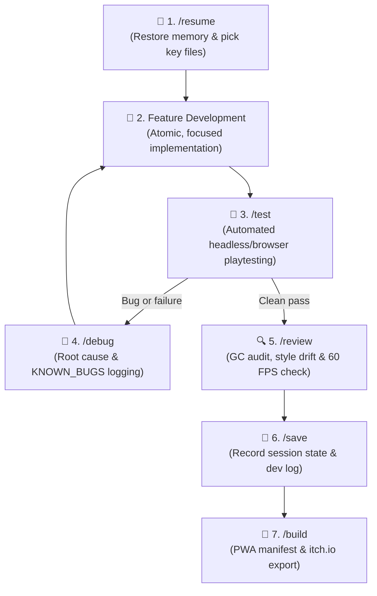

# 🎮 Agentic Games Template (Solo Dev Kit)

[](https://opensource.org/licenses/MIT)
[](#-core-engine-features)
[](#-slash-commands--skills)
[](#-performance-standards)

A professional, high-performance **HTML5 Canvas / Vanilla JavaScript** game development template and cognitive workflow kit optimized for **solo developers pair-programming with AI coding agents** (Antigravity IDE, Claude, Cursor, Copilot).

---

## 💡 Why This Template?

Building games with AI coding assistants can quickly lead to context explosion, spaghetti code, memory leaks (Garbage Collection spikes), and broken state machines. 

This repository solves these challenges with:
- **Zero Heavy Dependencies**: Pure ES Modules, zero external frameworks, and 100% transparent control.
- **Skill-First Cognitive System**: Automated AI behaviors via discrete slash commands (`/init`, `/test`, `/debug`, `/save`, `/resume`).
- **Single Source of Truth**: All architecture, game design, styling tokens, and bug logs live in `.agents/blueprint/`.
- **Long-Term Memory**: Seamlessly switch chats and save tokens without losing project context or architectural state.
- **Battle-Tested 60 FPS Standards**: Built-in object pooling, clamped delta-time, and procedural Web Audio.

---

## 🔄 The Solo Developer Loop

When developing with an AI assistant, maintain a disciplined, high-velocity loop:



---

## ⚡ Slash Commands & Skills

Control your AI assistant with crisp, standardized commands:

| Command | Skill | Description |
| :--- | :--- | :--- |
| `/resume` | `game-memory` | **Start of Day**: Restores memory from `SESSION_STATE.md` and loads only 2–4 key files to minimize token usage. |
| `/init` | `game-init` | **New Game**: Triggers a 4-question *Grill-Me* design interview, writes the blueprint, and scaffolds a working 60 FPS game. |
| `/onboard` | `game-onboard` | **Legacy Audit**: Dissects existing codebases, audits timing/rendering, and generates a blueprint structure. |
| `/test` | `game-test` | **Automated Playtest**: Runs the game in a browser subagent, checking for console errors, canvas drawing, 60 FPS stability, and captures screenshots. |
| `/debug` | `game-debug` | **Diagnostics**: Locates root causes (canvas coordinate bugs, NaN delta-time, z-index traps) and updates `KNOWN_BUGS.md`. |
| `/review` | `game-review` | **Quality Assurance**: Inspects for GC allocations in the game loop, God objects, and CSS Style Drift. |
| `/save` | `game-memory` | **End of Day**: Compiles session achievements, logs next steps in `SESSION_STATE.md` and commits to `DEV_LOG.md`. |
| `/build` | `game-deploy` | **Distribution**: Generates offline PWA service workers and packages zip builds for **itch.io** and **GitHub Pages**. |

---

## 📁 Repository Structure

```text
.
├── .agents/
│   ├── blueprint/              # 📌 Persistent Single Source of Truth
│   │   ├── GDD.md              # Game Design Document (rules, mechanics, inputs)
│   │   ├── ARCHITECTURE.md     # System architecture, class responsibilities, loop data flow
│   │   ├── STYLE_GUIDE.md      # 🎨 Design System: CSS tokens, button standards (.btn-*), HUD
│   │   ├── PROJECT_STATUS.md   # Current status, feature matrix, roadmap & technical debt
│   │   ├── CODE_REVIEW.md      # Performance and code health scorecards (A–F)
│   │   ├── KNOWN_BUGS.md       # Root-cause bug registry and fixed issues
│   │   ├── SESSION_STATE.md    # 🧠 Handoff baton between AI conversations
│   │   └── DEV_LOG.md          # 📜 Chronological developer diary
│   ├── rules/
│   │   └── game-dev.md         # Non-negotiable game dev rules (60 FPS, delta-time, pooling)
│   └── skills/                 # ⚡ Autonomous agent tools & execution prompts
│       ├── game-init/          # Scaffolding and interview logic
│       ├── game-onboard/       # Codebase discovery and architecture mapping
│       ├── game-review/        # GC, coupling, and style audits
│       ├── game-test/          # Automated browser verification
│       ├── game-debug/         # Diagnostic workflows
│       ├── game-memory/        # Token-efficient save/resume protocol
│       └── game-deploy/        # PWA & distribution export
├── AGENTS.md                   # 🎯 Primary AI Agent instruction card
├── README.md                   # 📖 Project documentation
└── .gitignore                  # 🛡️ Clean repository guard
```

---

## 🎮 Core Engine Features

When initialized (`/init`), the generated scaffold includes:

1. **Deterministic Engine (`src/core/Engine.js`)**:
   - 60 FPS `requestAnimationFrame` loop.
   - Protected delta-time (`Math.min(dt, 0.1)`) preventing spiral-of-death or huge jumps when switching tabs.
   - Built-in `visibilitychange` listener with auto-pause/resume and clock reconciliation.
   - Responsive aspect-ratio preservation (letterbox/pillarbox) with virtual coordinate translation (`screenToVirtual`).

2. **Unified Input Manager (`src/core/Input.js`)**:
   - Single abstraction for Keyboard (WASD/Arrows), Mouse, and on-screen Touch controls (virtual D-pad & action buttons).
   - Passive touch handling with `touch-action: none` to prevent unwanted scrolling on mobile.

3. **Procedural Web Audio (`src/core/Audio.js`)**:
   - 100% code-based procedural sound synthesis using the Web Audio API.
   - Out-of-the-box SFX: Jump, Laser/Shoot, Coin/Pickup, Hit, Explosion, and Victory Fanfare.
   - Precise audio clock scheduling (`ctx.currentTime`) with browser autoplay policy compliance.

4. **Zero-Allocation Particle System (`src/core/State.js`)**:
   - Particle emitter powered by an internal `ObjectPool` to guarantee smooth 60 FPS with zero GC frame stutter.

5. **Optimized Utility Library (`src/utils/`)**:
   - `ObjectPool.js`: Generic reusable object pool for bullets, particles, and temporary entities.
   - `math.js`: Fast math helpers (`lerp`, `clamp`, `distanceSq`, `normalize`, `angleBetween`).
   - `Collision.js`: Lightweight 2D collision tests (`circleVsCircle`, `rectVsRect`, `circleVsRect`, `pointInRect`).

---

## 🚀 Quick Start

### 1. Clone or Template
```bash
git clone https://github.com/Samrude1/Agentic-games-template.git my-game
cd my-game
```

### 2. Launch in your AI IDE
Open the folder in **Antigravity IDE**, **Cursor**, or your favorite AI coding environment.

### 3. Kick off your game
In your chat prompt, simply type:
```
/init
```
The agent will guide you through the 4-question game concept interview, generate your custom GDD and architecture, and spin up a playable game canvas.

---

## 📄 License

This project is licensed under the [MIT License](LICENSE). Feel free to use it for personal, commercial, or game jam projects!
